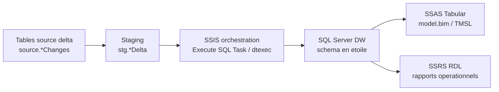

# msbi2-codespace-codex_and_o3

Sous-projet MSBI hybride pour GitHub Codespaces / poste local.

Objectif couvert :

- monter une base `DW` sur SQL Server 2022 ;
- charger des tables en mode delta dans cette meme base via une orchestration compatible SSIS ;
- exposer un modele SSAS Tabular en schema en etoile ;
- fournir des rapports SSRS qui lisent les vues de reporting de `DW`.

> Note de support : SQL Server Database Engine est lance en conteneur Linux. SSIS,
> SSAS et SSRS restent des briques Microsoft a executer sur les hotes adaptes
> (SSIS/SSAS/SSRS Windows, ou SSIS Linux natif selon vos contraintes). Le
> Codespace valide la logique SQL et les artefacts ; les scripts Windows
> deployent les briques BI sur une machine disposant des outils Microsoft.

## Demarrage rapide SQL + delta load

```bash
cd msbi2-codespace-codex_and_o3
cp .env.example .env
bash ./scripts/smoke-test.sh
```

Le smoke test :

1. demarre SQL Server 2022 avec Docker Compose ;
2. cree la base `DW`, les schemas `source`, `stg`, `dw`, `etl`, `rpt` ;
3. insere un premier lot source ;
4. execute le chargement delta initial ;
5. insere un second lot avec nouvelles lignes et mises a jour ;
6. execute le chargement delta suivant ;
7. verifie les dimensions, la table de faits, les watermarks et les vues de reporting.

## Architecture



## Contenu

- `compose.yaml` : SQL Server 2022 pour Codespace/local avec volumes Docker nommes.
- `sql/` : creation `DW`, donnees source, procedures delta, validation.
- `ssis/` : package SSIS `LoadDWDelta.dtsx`, source Biml et notes d'execution.
- `ssas/` : modele tabulaire `model.bim`; le script Windows le transforme en TMSL de deploiement.
- `ssrs/` : rapports RDL `SalesByRegion`, `MonthlySales`, `TopCustomers`.
- `scripts/` : deploiement, delta, validation, smoke test, deploiement et validation Windows BI.
- `docs/windows-bi-acceptance.md` : prerequis et workflow d'acceptation SSIS/SSAS/SSRS sur runner Windows.
- `tests/` : validations statiques executables en CI.

## Commandes utiles

```bash
./scripts/deploy.sh
./scripts/run-delta.sh
./scripts/validate.sh
docker compose logs -f mssql
docker compose down -v
```

## Deploiement SSIS / SSAS / SSRS

Sur une machine Windows avec SQL Server tooling :

```powershell
.\scripts\deploy-windows-bi.ps1 `
  -SqlServer "localhost,1433" `
  -SqlUser "sa" `
  -SqlPassword "Passw0rd123!" `
  -SsasServer "localhost" `
  -SsrsBaseUrl "http://localhost/ReportServer"
```

Le script Windows :

- verifie la connexion SQL ;
- execute `ssis/LoadDWDelta.dtsx` avec `dtexec` si le runtime SSIS est present ;
- deploie le modele SSAS via `Invoke-ASCmd` si le module `SqlServer` est present ;
- publie les RDL via `ReportingServicesTools` si le module est present.

Pour une validation stricte sur une machine Windows BI, executez :

```powershell
.\scripts\validate-windows-bi.ps1 `
  -SqlServer "localhost,1433" `
  -SqlUser "sa" `
  -SqlPassword "Passw0rd123!" `
  -SsasServer "localhost" `
  -SsrsBaseUrl "http://localhost/ReportServer"
```

Cette commande echoue si la DW n'a pas les resultats attendus, si `dtexec.exe`
ne peut pas executer `ssis/LoadDWDelta.dtsx`, si le modele SSAS ne repond pas a
une requete DAX, ou si SSRS ne rend pas le rapport `SalesByRegion` en PDF.

## Verification CI

```bash
python -m unittest discover -s msbi2-codespace-codex_and_o3/tests -v
cd msbi2-codespace-codex_and_o3 && bash ./scripts/smoke-test.sh
```

Le workflow GitHub `MSBI2 validation` execute les tests statiques et le smoke
test SQL Server. Les briques SSIS/SSAS/SSRS sont validees par
`scripts/validate-windows-bi.ps1` sur un hote Windows disposant de ces services.
Le workflow manuel `MSBI2 Windows BI acceptance` automatise cette validation sur
un runner Windows self-hosted ; voir `docs/windows-bi-acceptance.md`.
